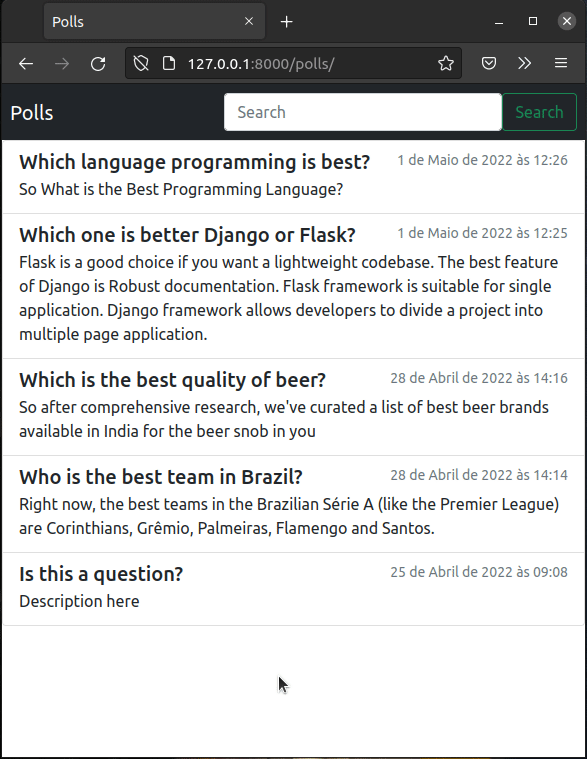

# VOTEST v0.1.0

## The Solution, with improvements, to tutorial [Django Polls App](https://docs.djangoproject.com/en/dev/intro/tutorial01/)

In tutorial, the app consists of two parts:

* A public site that lets people view polls and vote in them.
* An admin site that lets you add, change, and delete polls.

After the tutorial ended, I implemented the following features:

* A basic frontend with the help of [Bootstrap](link);
* A top navigation bar with search field (in all templates);
* The search field returns a page with all the results of the search;

### Future features (next releases):

 * [ ] User dashboards;
 * [ ] Frontend improvements;

# Getting Starded

First, install virtualenv in your project directory, activate it and then install the requirements. Enter the commands:
~~~
 ~/[project_directory]: virtualenv env
 ~/[project_directory]: source env/bin/activate
(env) ~/[project_directory]: pip install -r requirements.txt
~~~

So, clone this toturial typing:
~~~
git clone https://github.com/filipevsco/django-poll-app-improvements.git
~~~
or simply download: https://github.com/filipevsco/django-poll-app-improvements.git

## Running in local sercer

Type:
~~~
(env) ~/[project_directory]: python manage.py runserver
~~~
Then go to http://127.0.0.1:8000/polls/ and http://127.0.0.1:8000/admin/

Don't foger to create a superuser:
~~~
(env) ~/[project_directory]:  python manage.py createsuperuser 
~~~

# Preview of Polls App

# Author

Filipe Vasconcelos - @filipevsco

email: filipev@me.com